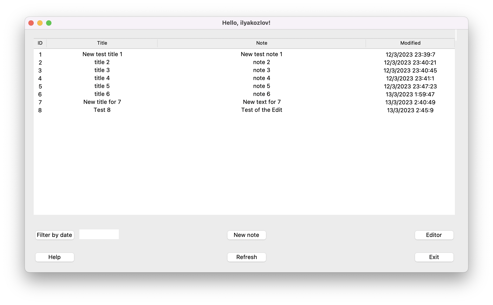
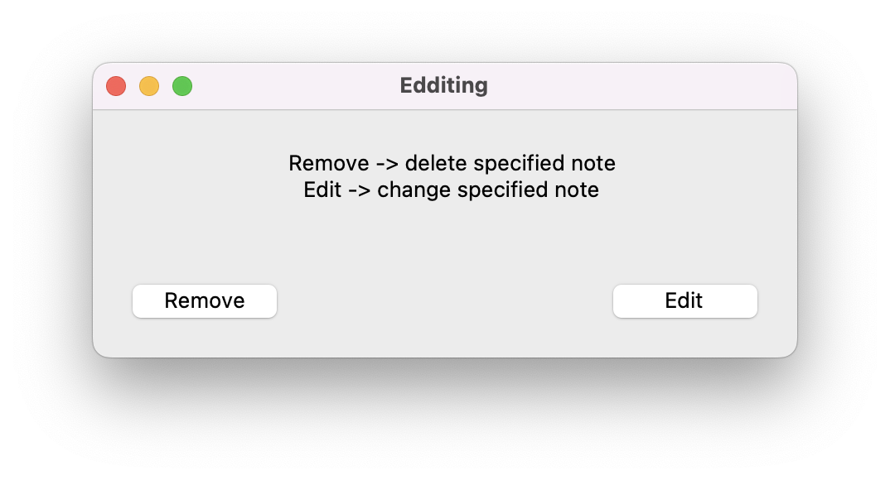
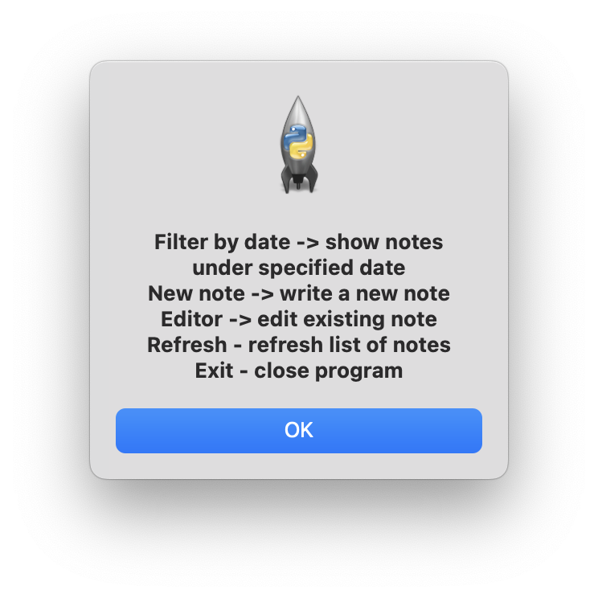

# README file for Exercise001 of GB intermediate assessment

## Key elements of main (starting) screen of application

**Main display area** -> all stored notes are shown here with ID, Title, Note body and date of creation/ modification

*Filter by date* -> sort stored notes by date specified by User

*New note* -> create of new note

Programm will automatically assign new note with new ID. User is requested to enter title and body of new note.
 

*Editor* - > remove or edit note specified by User

Once one of two options is chosen (remove/ edit), User is requested to specify ID of note to be processed.

*Help* -> show list of avaliable commands

*Refresh* -> update list of stored notes

*Exit* -> close program