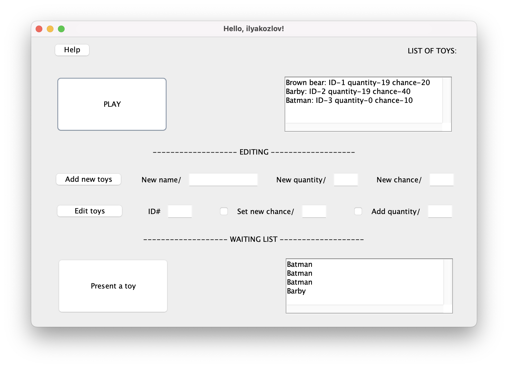
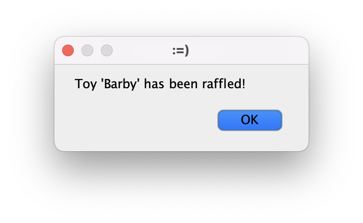
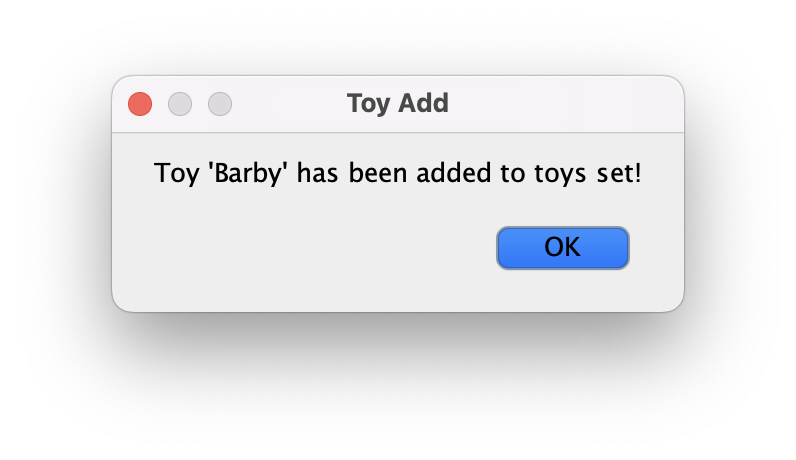
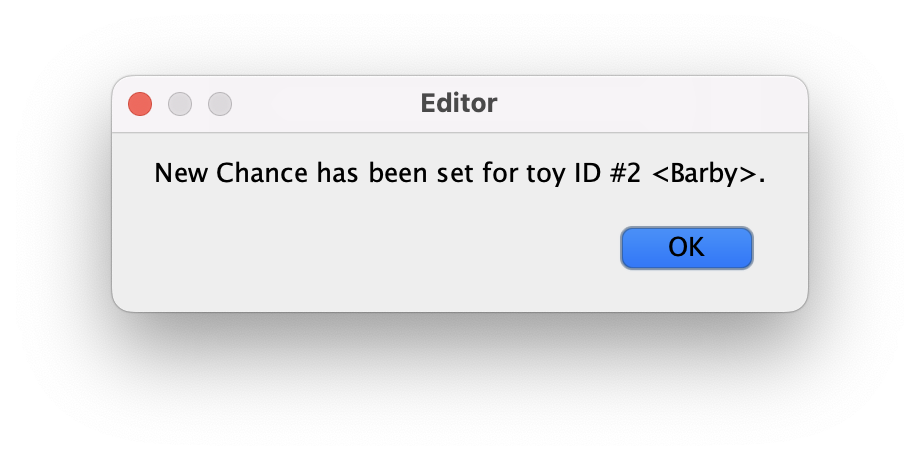
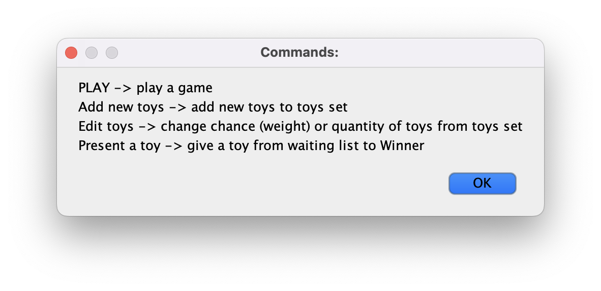

# README file for Exercise002 of GB intermediate assessment

## Applcation for toys raffling

## Main features of the Application

Application works with external database (.txt file) where toys set is stored.

List of toys which are now stored in database and available for raffle is shown in *List of toys* textfield. This field contains such information as: ID, quantity and chance of each toy from the stored toys set.

By pressing button *PLAY* User initiates a single round of raffle:

A toy is randomly chosen from the toys set -> depending on chance of the toy it can be either won or not. In case of Victory quantity of toy which has been raffled is decreased. Stored toys set and *List of toys* Text Field are updated.

After each Victory a toy which has been won is moved to waiting list, which is displayed in *Waiting List* Area. Once button *Present a toy* is pressed, one toy is removed from the head of the waiting list and an entry with information about name of the toy and Date/Time is stored in dedicated register. 

## Editing features of the Application

Application provides two options:
1. *Add new toys* -> add new toys to stored toys set
2. *Edit toys* -> change chance or quantity of a toy from stored toys set

Depending on which option is chosen User is intended to enter such information as: name of new toy, quantity of new (or existing) toy, chance of new (pr existing) toy. For Editig User is also requsted to enter ID of a toy to be edited.

Once operation is done stored toys set and *List of toys* textfield are updated.

## Help

If there are some doubts button *Help* will display definition of each button.

